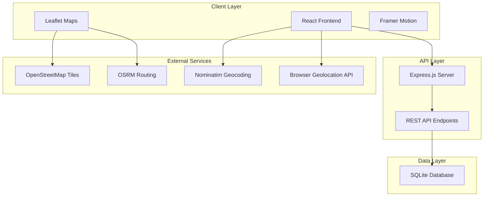
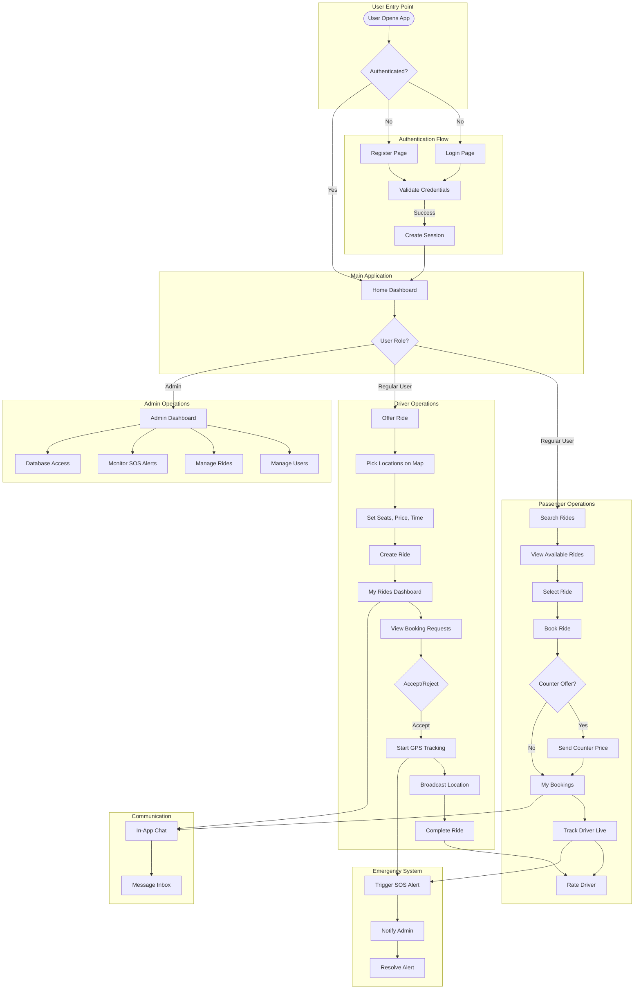
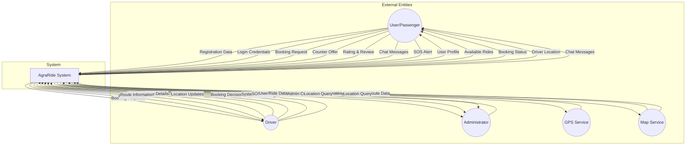
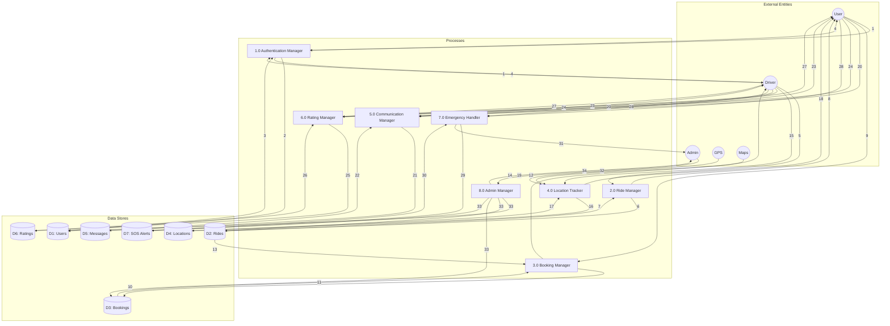
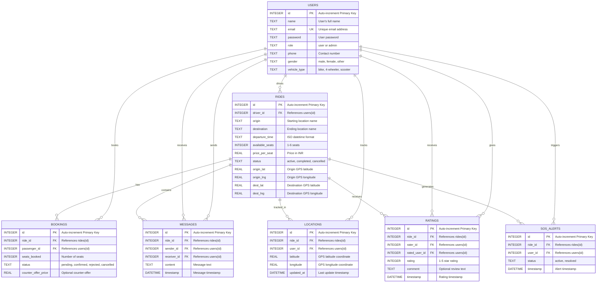
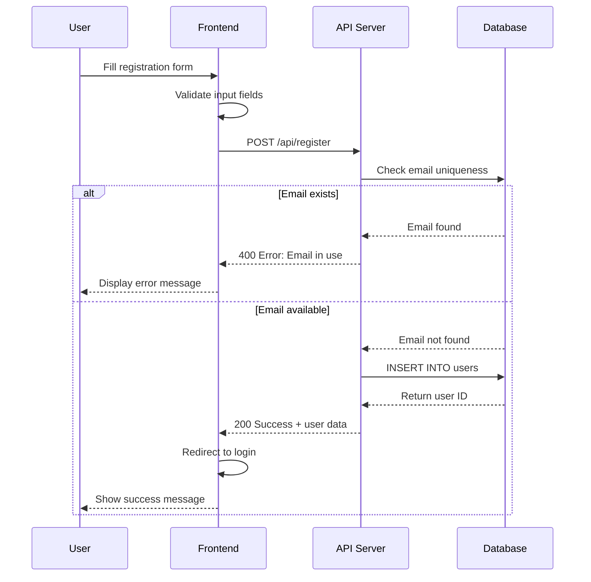
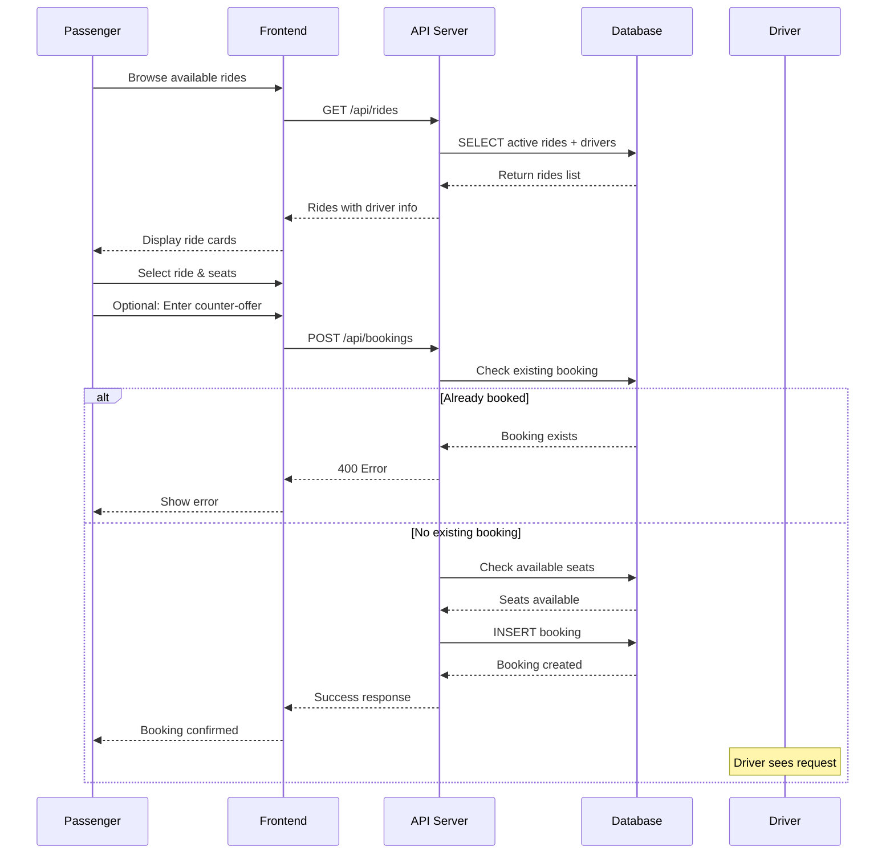
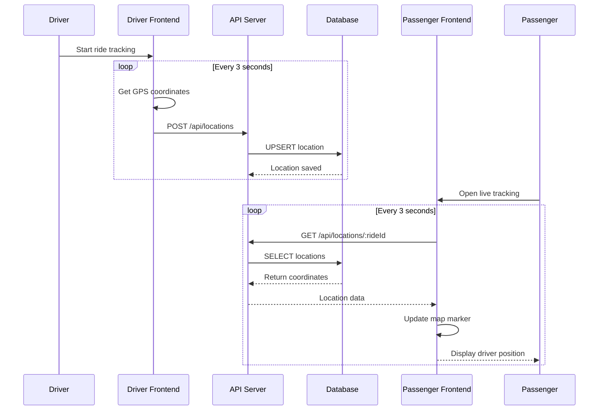
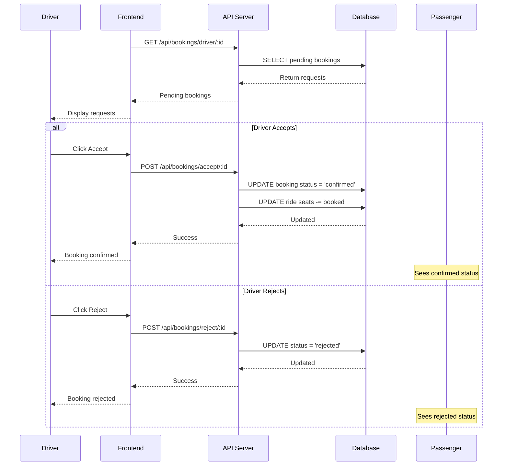
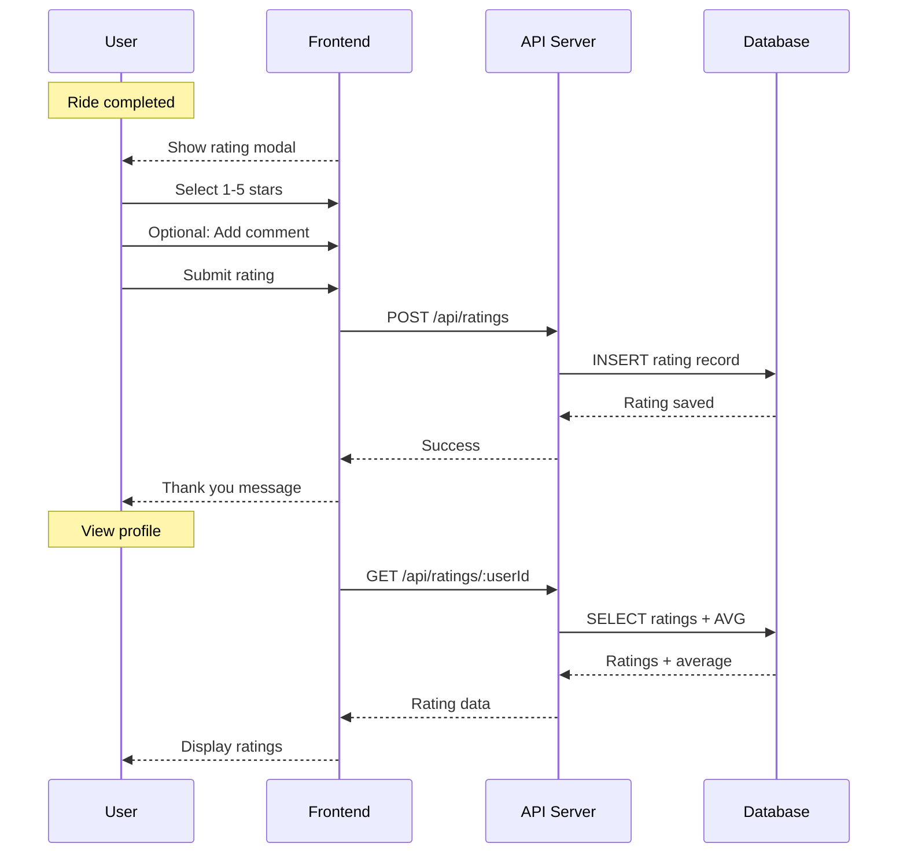

<div align="center">

# 🚗 AgraRide - System Architecture & Design Documentation


**A comprehensive carpooling platform connecting drivers and passengers in Agra, India**

[System Flow](#-system-flow) • [DFD Level 0](#-data-flow-diagram---level-0-context-diagram) • [DFD Level 1](#-data-flow-diagram---level-1) • [ER Diagram](#-entity-relationship-diagram) • [Process Flow](#-detailed-process-flows)

</div>

---

## 📋 Table of Contents

- [System Overview](#-system-overview)
- [System Flow](#-system-flow)
- [Data Flow Diagram - Level 0](#-data-flow-diagram---level-0-context-diagram)
- [Data Flow Diagram - Level 1](#-data-flow-diagram---level-1)
- [Entity Relationship Diagram](#-entity-relationship-diagram)
- [Detailed Process Flows](#-detailed-process-flows)
- [Database Schema Details](#-database-schema-details)
- [API Endpoint Reference](#-api-endpoint-reference)

---

## 🎯 System Overview

### What is AgraRide?

AgraRide is a **full-stack carpooling web application** designed specifically for Agra, India. It connects drivers offering rides with passengers seeking affordable transportation along similar routes.

### Key Objectives

| Objective | Description |
|-----------|-------------|
| 🚦 **Reduce Traffic** | Decrease vehicle count on roads through ride-sharing |
| 💰 **Cost Sharing** | Enable affordable commuting for all users |
| 🛡️ **Safety First** | Real-time GPS tracking and emergency SOS system |
| 💬 **Communication** | In-app messaging between drivers and passengers |
| ⭐ **Trust Building** | Rating and review system for community trust |

### System Actors

```
┌─────────────────────────────────────────────────────────────────┐
│                        AGRARIDE ACTORS                          │
├─────────────────────────────────────────────────────────────────┤
│                                                                 │
│   👤 PASSENGER              👨‍✈️ DRIVER              👨‍💼 ADMIN         │
│   ───────────              ──────────              ─────────    │
│   • Search rides           • Offer rides           • Manage     │
│   • Book rides             • Accept/Reject           users      │
│   • Track live             • Track GPS            • Monitor     │
│   • Rate drivers           • Rate passengers        rides       │
│   • Send messages          • Communicate          • Handle SOS  │
│   • Trigger SOS            • Trigger SOS          • DB Access   │
│                                                                 │
└─────────────────────────────────────────────────────────────────┘
```

---

## 🔄 System Flow

### High-Level System Architecture



### Complete System Flow Diagram



### Flow Description

| Phase | Description | Key Actions |
|-------|-------------|-------------|
| **1. Entry** | User accesses the application | Check authentication status |
| **2. Auth** | User registers or logs in | Validate credentials, create session |
| **3. Navigation** | User reaches main dashboard | Route based on user role |
| **4. Driver Flow** | Driver offers and manages rides | Create ride, manage bookings, track |
| **5. Passenger Flow** | Passenger searches and books rides | Search, book, track, rate |
| **6. Communication** | Users interact via messages | Send/receive messages per ride |
| **7. Emergency** | Handle emergency situations | SOS alert, admin notification |
| **8. Admin Flow** | System administration | Manage users, rides, database |

---

## 📊 Data Flow Diagram - Level 0 (Context Diagram)

### Overview

The **Level 0 DFD** (Context Diagram) shows the entire system as a single process and its interaction with external entities.

### Context Diagram



### Data Flow Descriptions (Level 0)

| Flow ID | Source | Destination | Data Description |
|---------|--------|-------------|------------------|
| **DF-01** | User | System | Registration data (name, email, password, phone, gender, vehicle) |
| **DF-02** | User | System | Login credentials (email, password) |
| **DF-03** | User | System | Booking request (ride_id, seats, counter_offer) |
| **DF-04** | System | User | Available rides list with driver details |
| **DF-05** | System | User | Real-time driver location coordinates |
| **DF-06** | Driver | System | Ride offering details (origin, destination, time, seats, price) |
| **DF-07** | Driver | System | GPS location updates (latitude, longitude) |
| **DF-08** | System | Driver | Pending booking requests with passenger info |
| **DF-09** | Admin | System | Management commands (delete, update, query) |
| **DF-10** | System | Admin | System statistics and SOS alerts |
| **DF-11** | GPS Service | System | Real-time geolocation coordinates |
| **DF-12** | Map Service | System | Map tiles and routing information |

---

## 📈 Data Flow Diagram - Level 1

### Overview

The **Level 1 DFD** decomposes the main system into its major processes, showing detailed data flows between processes and data stores.

### Level 1 DFD Diagram



### Process Descriptions (Level 1)

#### Process 1.0 - Authentication Manager

```
┌─────────────────────────────────────────────────────────────────┐
│                 1.0 AUTHENTICATION MANAGER                      │
├─────────────────────────────────────────────────────────────────┤
│ PURPOSE: Handle user registration, login, and profile mgmt     │
│                                                                 │
│ INPUT FLOWS:                                                    │
│   • Registration Data (name, email, password, phone, gender)   │
│   • Login Credentials (email, password)                        │
│   • Profile Update Data                                        │
│                                                                 │
│ OUTPUT FLOWS:                                                   │
│   • User Session Data                                          │
│   • Authentication Status                                      │
│   • User Profile Information                                   │
│                                                                 │
│ DATA STORES ACCESSED:                                          │
│   • D1: Users (READ/WRITE)                                     │
│                                                                 │
│ OPERATIONS:                                                     │
│   1. Validate registration input                               │
│   2. Check email uniqueness                                    │
│   3. Create user record                                        │
│   4. Authenticate login credentials                            │
│   5. Generate session token                                    │
│   6. Update user profile                                       │
└─────────────────────────────────────────────────────────────────┘
```

#### Process 2.0 - Ride Manager

```
┌─────────────────────────────────────────────────────────────────┐
│                     2.0 RIDE MANAGER                            │
├─────────────────────────────────────────────────────────────────┤
│ PURPOSE: Manage ride creation, modification, and retrieval     │
│                                                                 │
│ INPUT FLOWS:                                                    │
│   • Ride Details (origin, destination, time, seats, price)     │
│   • GPS Coordinates (origin_lat/lng, dest_lat/lng)             │
│   • Ride Status Updates                                        │
│                                                                 │
│ OUTPUT FLOWS:                                                   │
│   • Available Rides List                                       │
│   • Ride Details with Driver Info                              │
│   • Ride Status                                                │
│                                                                 │
│ DATA STORES ACCESSED:                                          │
│   • D2: Rides (READ/WRITE)                                     │
│   • D1: Users (READ - for driver info)                         │
│                                                                 │
│ OPERATIONS:                                                     │
│   1. Create new ride with GPS coordinates                      │
│   2. Fetch active rides with driver details                    │
│   3. Update ride information                                   │
│   4. Mark ride as completed/cancelled                          │
│   5. Delete ride with cascade cleanup                          │
│   6. Get driver's ride history                                 │
└─────────────────────────────────────────────────────────────────┘
```

#### Process 3.0 - Booking Manager

```
┌─────────────────────────────────────────────────────────────────┐
│                    3.0 BOOKING MANAGER                          │
├─────────────────────────────────────────────────────────────────┤
│ PURPOSE: Handle booking requests, counter-offers, approvals    │
│                                                                 │
│ INPUT FLOWS:                                                    │
│   • Booking Request (ride_id, passenger_id, seats)             │
│   • Counter Offer Price                                        │
│   • Booking Decision (accept/reject)                           │
│                                                                 │
│ OUTPUT FLOWS:                                                   │
│   • Booking Status                                             │
│   • Pending Requests to Driver                                 │
│   • Passenger Booking History                                  │
│                                                                 │
│ DATA STORES ACCESSED:                                          │
│   • D3: Bookings (READ/WRITE)                                  │
│   • D2: Rides (READ/WRITE - for seat updates)                  │
│   • D1: Users (READ - for passenger info)                      │
│                                                                 │
│ OPERATIONS:                                                     │
│   1. Validate booking (no duplicates, sufficient seats)        │
│   2. Create booking with optional counter-offer                │
│   3. Fetch pending requests for driver                         │
│   4. Accept booking (update status, reduce seats)              │
│   5. Reject booking (update status)                            │
│   6. Get passenger booking history                             │
└─────────────────────────────────────────────────────────────────┘
```

#### Process 4.0 - Location Tracker

```
┌─────────────────────────────────────────────────────────────────┐
│                   4.0 LOCATION TRACKER                          │
├─────────────────────────────────────────────────────────────────┤
│ PURPOSE: Real-time GPS tracking during active rides            │
│                                                                 │
│ INPUT FLOWS:                                                    │
│   • GPS Coordinates (latitude, longitude)                      │
│   • User/Ride Identifiers                                      │
│   • Map Tile Requests                                          │
│                                                                 │
│ OUTPUT FLOWS:                                                   │
│   • Driver Location on Map                                     │
│   • Route Visualization                                        │
│   • Distance/ETA Calculations                                  │
│                                                                 │
│ DATA STORES ACCESSED:                                          │
│   • D4: Locations (READ/WRITE)                                 │
│                                                                 │
│ OPERATIONS:                                                     │
│   1. Capture driver GPS position (every 3 seconds)             │
│   2. Update/Insert location record                             │
│   3. Fetch locations for ride                                  │
│   4. Calculate route from origin to destination                │
│   5. Display markers (pickup, destination, driver)             │
│   6. Auto-recenter map on driver position                      │
└─────────────────────────────────────────────────────────────────┘
```

#### Process 5.0 - Communication Manager

```
┌─────────────────────────────────────────────────────────────────┐
│                 5.0 COMMUNICATION MANAGER                       │
├─────────────────────────────────────────────────────────────────┤
│ PURPOSE: Handle in-app messaging between users                 │
│                                                                 │
│ INPUT FLOWS:                                                    │
│   • Message Content                                            │
│   • Sender/Receiver/Ride IDs                                   │
│   • Inbox Request                                              │
│                                                                 │
│ OUTPUT FLOWS:                                                   │
│   • Message History                                            │
│   • Conversation List                                          │
│   • Real-time Message Updates                                  │
│                                                                 │
│ DATA STORES ACCESSED:                                          │
│   • D5: Messages (READ/WRITE)                                  │
│   • D1: Users (READ - for sender names)                        │
│   • D2: Rides (READ - for ride context)                        │
│                                                                 │
│ OPERATIONS:                                                     │
│   1. Send message (store with timestamp)                       │
│   2. Fetch ride messages (chronological order)                 │
│   3. Get user's conversation inbox                             │
│   4. Poll for new messages (every 3 seconds)                   │
│   5. Display messages with sender distinction                  │
└─────────────────────────────────────────────────────────────────┘
```

#### Process 6.0 - Rating Manager

```
┌─────────────────────────────────────────────────────────────────┐
│                    6.0 RATING MANAGER                           │
├─────────────────────────────────────────────────────────────────┤
│ PURPOSE: Manage post-ride ratings and reviews                  │
│                                                                 │
│ INPUT FLOWS:                                                    │
│   • Rating Data (1-5 stars)                                    │
│   • Review Comment (optional)                                  │
│   • Ride/User Context                                          │
│                                                                 │
│ OUTPUT FLOWS:                                                   │
│   • Average Rating                                             │
│   • Rating History                                             │
│   • Review Display                                             │
│                                                                 │
│ DATA STORES ACCESSED:                                          │
│   • D6: Ratings (READ/WRITE)                                   │
│   • D1: Users (READ - for rater names)                         │
│                                                                 │
│ OPERATIONS:                                                     │
│   1. Submit rating after ride completion                       │
│   2. Store rating with optional comment                        │
│   3. Calculate average rating for user                         │
│   4. Fetch user's rating history                               │
│   5. Display ratings on profile                                │
└─────────────────────────────────────────────────────────────────┘
```

#### Process 7.0 - Emergency Handler

```
┌─────────────────────────────────────────────────────────────────┐
│                   7.0 EMERGENCY HANDLER                         │
├─────────────────────────────────────────────────────────────────┤
│ PURPOSE: Handle SOS emergency alerts during rides              │
│                                                                 │
│ INPUT FLOWS:                                                    │
│   • SOS Trigger (ride_id, user_id)                             │
│   • Resolution Command                                         │
│                                                                 │
│ OUTPUT FLOWS:                                                   │
│   • Alert to Admin Dashboard                                   │
│   • Alert Status Updates                                       │
│   • Ride/Participant Details                                   │
│                                                                 │
│ DATA STORES ACCESSED:                                          │
│   • D7: SOS Alerts (READ/WRITE)                                │
│   • D2: Rides (READ - for ride context)                        │
│   • D1: Users (READ - for participant info)                    │
│                                                                 │
│ OPERATIONS:                                                     │
│   1. Create SOS alert with timestamp                           │
│   2. Notify admin dashboard immediately                        │
│   3. Display alert with ride and user details                  │
│   4. Provide live tracking link                                │
│   5. Mark alert as resolved                                    │
└─────────────────────────────────────────────────────────────────┘
```

#### Process 8.0 - Admin Manager

```
┌─────────────────────────────────────────────────────────────────┐
│                    8.0 ADMIN MANAGER                            │
├─────────────────────────────────────────────────────────────────┤
│ PURPOSE: System administration and monitoring                  │
│                                                                 │
│ INPUT FLOWS:                                                    │
│   • Admin Commands (delete, update, query)                     │
│   • Search/Filter Criteria                                     │
│   • SQL Queries                                                │
│                                                                 │
│ OUTPUT FLOWS:                                                   │
│   • System Statistics                                          │
│   • User/Ride Lists                                            │
│   • Query Results                                              │
│   • Active SOS Alerts                                          │
│                                                                 │
│ DATA STORES ACCESSED:                                          │
│   • All Data Stores (READ/WRITE)                               │
│                                                                 │
│ OPERATIONS:                                                     │
│   1. Generate system statistics                                │
│   2. List all users with search/filter                         │
│   3. Delete user with cascade cleanup                          │
│   4. Change user role (user/admin)                             │
│   5. Manage rides (complete, delete)                           │
│   6. Monitor and resolve SOS alerts                            │
│   7. Execute custom SQL queries                                │
│   8. View database tables                                      │
└─────────────────────────────────────────────────────────────────┘
```

### Data Flow Descriptions (Level 1)

| Flow # | From | To | Description |
|--------|------|-----|-------------|
| 1 | User/Driver | P1 | Authentication credentials |
| 2 | P1 | D1:Users | Store/update user data |
| 3 | D1:Users | P1 | Retrieve user for validation |
| 4 | P1 | User/Driver | Session/profile response |
| 5 | Driver | P2 | Ride creation data |
| 6 | P2 | D2:Rides | Store ride details |
| 7 | D2:Rides | P2 | Retrieve ride information |
| 8 | P2 | User | Available rides list |
| 9 | User | P3 | Booking request |
| 10 | P3 | D3:Bookings | Store booking record |
| 11 | D3:Bookings | P3 | Retrieve booking data |
| 12 | P3 | Driver | Pending booking notification |
| 13 | D2:Rides | P3 | Ride details for booking |
| 14 | GPS | P4 | Real-time coordinates |
| 15 | Driver | P4 | Location broadcast |
| 16 | P4 | D4:Locations | Store location update |
| 17 | D4:Locations | P4 | Retrieve location history |
| 18 | P4 | User | Driver location on map |
| 19 | Maps | P4 | Route and tile data |
| 20 | User/Driver | P5 | Message content |
| 21 | P5 | D5:Messages | Store message |
| 22 | D5:Messages | P5 | Retrieve messages |
| 23 | P5 | User/Driver | Message display |
| 24 | User/Driver | P6 | Rating submission |
| 25 | P6 | D6:Ratings | Store rating |
| 26 | D6:Ratings | P6 | Retrieve ratings |
| 27 | P6 | User/Driver | Rating display |
| 28 | User/Driver | P7 | SOS trigger |
| 29 | P7 | D7:SOS Alerts | Store alert |
| 30 | D7:SOS Alerts | P7 | Retrieve alerts |
| 31 | P7 | Admin | Alert notification |
| 32 | Admin | P8 | Admin commands |
| 33 | P8 | All Stores | CRUD operations |
| 34 | P8 | Admin | Statistics/results |

---

## 🗄️ Entity Relationship Diagram

### ER Diagram Overview

The database consists of **7 entities** with clear relationships representing users, rides, bookings, real-time tracking, messaging, ratings, and emergency alerts.

### Complete ER Diagram



### Entity Descriptions

#### 1. USERS Entity

| Attribute | Data Type | Constraints | Description |
|-----------|-----------|-------------|-------------|
| `id` | INTEGER | PRIMARY KEY, AUTO_INCREMENT | Unique identifier |
| `name` | TEXT | NOT NULL | User's full name |
| `email` | TEXT | UNIQUE, NOT NULL | Login email address |
| `password` | TEXT | NOT NULL | User password |
| `role` | TEXT | DEFAULT 'user' | User role (user/admin) |
| `phone` | TEXT | NULLABLE | Contact phone number |
| `gender` | TEXT | NULLABLE | Gender (male/female/other) |
| `vehicle_type` | TEXT | NULLABLE | Vehicle type owned |

#### 2. RIDES Entity

| Attribute | Data Type | Constraints | Description |
|-----------|-----------|-------------|-------------|
| `id` | INTEGER | PRIMARY KEY, AUTO_INCREMENT | Unique identifier |
| `driver_id` | INTEGER | FOREIGN KEY → users(id) | Driver offering the ride |
| `origin` | TEXT | NOT NULL | Starting location name |
| `destination` | TEXT | NOT NULL | Ending location name |
| `departure_time` | TEXT | NOT NULL | ISO format datetime |
| `available_seats` | INTEGER | NOT NULL | Available seats (1-6) |
| `price_per_seat` | REAL | NOT NULL | Price per seat in INR |
| `status` | TEXT | DEFAULT 'active' | Ride status |
| `origin_lat` | REAL | NULLABLE | Origin latitude |
| `origin_lng` | REAL | NULLABLE | Origin longitude |
| `dest_lat` | REAL | NULLABLE | Destination latitude |
| `dest_lng` | REAL | NULLABLE | Destination longitude |

#### 3. BOOKINGS Entity

| Attribute | Data Type | Constraints | Description |
|-----------|-----------|-------------|-------------|
| `id` | INTEGER | PRIMARY KEY, AUTO_INCREMENT | Unique identifier |
| `ride_id` | INTEGER | FOREIGN KEY → rides(id) | Associated ride |
| `passenger_id` | INTEGER | FOREIGN KEY → users(id) | Booking passenger |
| `seats_booked` | INTEGER | NOT NULL | Number of seats |
| `status` | TEXT | DEFAULT 'pending' | Booking status |
| `counter_offer_price` | REAL | NULLABLE | Counter-offer amount |

#### 4. LOCATIONS Entity

| Attribute | Data Type | Constraints | Description |
|-----------|-----------|-------------|-------------|
| `id` | INTEGER | PRIMARY KEY, AUTO_INCREMENT | Unique identifier |
| `ride_id` | INTEGER | FOREIGN KEY → rides(id) | Associated ride |
| `user_id` | INTEGER | FOREIGN KEY → users(id) | User being tracked |
| `latitude` | REAL | NULLABLE | GPS latitude |
| `longitude` | REAL | NULLABLE | GPS longitude |
| `updated_at` | DATETIME | DEFAULT CURRENT_TIMESTAMP | Last update time |

#### 5. MESSAGES Entity

| Attribute | Data Type | Constraints | Description |
|-----------|-----------|-------------|-------------|
| `id` | INTEGER | PRIMARY KEY, AUTO_INCREMENT | Unique identifier |
| `ride_id` | INTEGER | FOREIGN KEY → rides(id) | Ride context |
| `sender_id` | INTEGER | FOREIGN KEY → users(id) | Message sender |
| `receiver_id` | INTEGER | FOREIGN KEY → users(id) | Message receiver |
| `content` | TEXT | NOT NULL | Message content |
| `timestamp` | DATETIME | DEFAULT CURRENT_TIMESTAMP | Message time |

#### 6. RATINGS Entity

| Attribute | Data Type | Constraints | Description |
|-----------|-----------|-------------|-------------|
| `id` | INTEGER | PRIMARY KEY, AUTO_INCREMENT | Unique identifier |
| `ride_id` | INTEGER | FOREIGN KEY → rides(id) | Ride context |
| `rater_id` | INTEGER | FOREIGN KEY → users(id) | User giving rating |
| `rated_user_id` | INTEGER | FOREIGN KEY → users(id) | User being rated |
| `rating` | INTEGER | CHECK (1-5) | Star rating |
| `comment` | TEXT | NULLABLE | Review comment |
| `timestamp` | DATETIME | DEFAULT CURRENT_TIMESTAMP | Rating time |

#### 7. SOS_ALERTS Entity

| Attribute | Data Type | Constraints | Description |
|-----------|-----------|-------------|-------------|
| `id` | INTEGER | PRIMARY KEY, AUTO_INCREMENT | Unique identifier |
| `ride_id` | INTEGER | FOREIGN KEY → rides(id) | Associated ride |
| `user_id` | INTEGER | FOREIGN KEY → users(id) | Alert trigger user |
| `status` | TEXT | DEFAULT 'active' | Alert status |
| `timestamp` | DATETIME | DEFAULT CURRENT_TIMESTAMP | Alert time |

### Relationship Summary

| Relationship | Type | Description |
|--------------|------|-------------|
| Users → Rides | 1:N | A user (driver) can offer many rides |
| Users → Bookings | 1:N | A user (passenger) can make many bookings |
| Rides → Bookings | 1:N | A ride can have multiple bookings |
| Rides → Locations | 1:N | A ride can have multiple location updates |
| Rides → Messages | 1:N | A ride can contain many messages |
| Rides → Ratings | 1:N | A ride can receive multiple ratings |
| Rides → SOS_Alerts | 1:N | A ride can generate multiple SOS alerts |
| Users → Messages | 1:N | A user can send/receive many messages |
| Users → Ratings | 1:N | A user can give/receive many ratings |
| Users → Locations | 1:N | A user can have location tracked |
| Users → SOS_Alerts | 1:N | A user can trigger multiple alerts |

---

## 🔄 Detailed Process Flows

### 1. User Registration Flow



### 2. Ride Booking Flow



### 3. Live Tracking Flow



### 4. Booking Approval Flow



### 5. Rating Submission Flow



---

## 📚 Database Schema Details

### SQL Schema Definition

```sql
-- 1. USERS TABLE
CREATE TABLE IF NOT EXISTS users (
    id INTEGER PRIMARY KEY AUTOINCREMENT,
    name TEXT NOT NULL,
    email TEXT UNIQUE NOT NULL,
    password TEXT NOT NULL,
    role TEXT DEFAULT 'user',      -- 'user' or 'admin'
    phone TEXT,
    gender TEXT,                    -- 'male', 'female', 'other'
    vehicle_type TEXT               -- 'bike', '4-wheeler', 'scooter'
);

-- 2. RIDES TABLE
CREATE TABLE IF NOT EXISTS rides (
    id INTEGER PRIMARY KEY AUTOINCREMENT,
    driver_id INTEGER,
    origin TEXT NOT NULL,
    destination TEXT NOT NULL,
    departure_time TEXT NOT NULL,
    available_seats INTEGER NOT NULL,
    price_per_seat REAL NOT NULL,
    status TEXT DEFAULT 'active',   -- 'active', 'completed', 'cancelled'
    origin_lat REAL,
    origin_lng REAL,
    dest_lat REAL,
    dest_lng REAL,
    FOREIGN KEY (driver_id) REFERENCES users (id)
);

-- 3. BOOKINGS TABLE
CREATE TABLE IF NOT EXISTS bookings (
    id INTEGER PRIMARY KEY AUTOINCREMENT,
    ride_id INTEGER,
    passenger_id INTEGER,
    seats_booked INTEGER NOT NULL,
    status TEXT DEFAULT 'pending',  -- 'pending', 'confirmed', 'rejected', 'cancelled'
    counter_offer_price REAL,
    FOREIGN KEY (ride_id) REFERENCES rides (id),
    FOREIGN KEY (passenger_id) REFERENCES users (id)
);

-- 4. LOCATIONS TABLE
CREATE TABLE IF NOT EXISTS locations (
    id INTEGER PRIMARY KEY AUTOINCREMENT,
    ride_id INTEGER,
    user_id INTEGER,
    latitude REAL,
    longitude REAL,
    updated_at DATETIME DEFAULT CURRENT_TIMESTAMP,
    FOREIGN KEY (ride_id) REFERENCES rides (id),
    FOREIGN KEY (user_id) REFERENCES users (id)
);

-- 5. MESSAGES TABLE
CREATE TABLE IF NOT EXISTS messages (
    id INTEGER PRIMARY KEY AUTOINCREMENT,
    ride_id INTEGER,
    sender_id INTEGER,
    receiver_id INTEGER,
    content TEXT NOT NULL,
    timestamp DATETIME DEFAULT CURRENT_TIMESTAMP,
    FOREIGN KEY (ride_id) REFERENCES rides (id),
    FOREIGN KEY (sender_id) REFERENCES users (id),
    FOREIGN KEY (receiver_id) REFERENCES users (id)
);

-- 6. RATINGS TABLE
CREATE TABLE IF NOT EXISTS ratings (
    id INTEGER PRIMARY KEY AUTOINCREMENT,
    ride_id INTEGER,
    rater_id INTEGER,
    rated_user_id INTEGER,
    rating INTEGER CHECK (rating >= 1 AND rating <= 5),
    comment TEXT,
    timestamp DATETIME DEFAULT CURRENT_TIMESTAMP,
    FOREIGN KEY (ride_id) REFERENCES rides (id),
    FOREIGN KEY (rater_id) REFERENCES users (id),
    FOREIGN KEY (rated_user_id) REFERENCES users (id)
);

-- 7. SOS_ALERTS TABLE
CREATE TABLE IF NOT EXISTS sos_alerts (
    id INTEGER PRIMARY KEY AUTOINCREMENT,
    ride_id INTEGER,
    user_id INTEGER,
    status TEXT DEFAULT 'active',   -- 'active', 'resolved'
    timestamp DATETIME DEFAULT CURRENT_TIMESTAMP,
    FOREIGN KEY (ride_id) REFERENCES rides (id),
    FOREIGN KEY (user_id) REFERENCES users (id)
);
```

---

## 🌐 API Endpoint Reference

### Authentication Endpoints

| Method | Endpoint | Description | Request Body |
|--------|----------|-------------|--------------|
| POST | `/api/register` | Register new user | `{name, email, password, phone, gender, vehicle_type}` |
| POST | `/api/login` | User login | `{email, password}` |
| GET | `/api/users/:id` | Get user profile | - |
| PUT | `/api/users/:id` | Update profile | `{name?, email?, password?, phone?, gender?, vehicle_type?}` |

### Ride Management Endpoints

| Method | Endpoint | Description | Request Body |
|--------|----------|-------------|--------------|
| GET | `/api/rides` | Get all active rides | - |
| POST | `/api/rides` | Create new ride | `{driver_id, origin, destination, departure_time, available_seats, price_per_seat, origin_lat, origin_lng, dest_lat, dest_lng}` |
| PUT | `/api/rides/:id` | Update ride | Same as create |
| DELETE | `/api/rides/:id` | Delete ride | - |
| POST | `/api/rides/complete/:id` | Complete ride | - |
| GET | `/api/rides/driver/:driverId` | Get driver's rides | - |

### Booking Endpoints

| Method | Endpoint | Description | Request Body |
|--------|----------|-------------|--------------|
| POST | `/api/bookings` | Create booking | `{ride_id, passenger_id, seats_booked, counter_offer_price?}` |
| POST | `/api/bookings/accept/:id` | Accept booking | - |
| POST | `/api/bookings/reject/:id` | Reject booking | - |
| GET | `/api/bookings/driver/:driverId` | Driver's requests | - |
| GET | `/api/bookings/passenger/:passengerId` | Passenger's bookings | - |
| GET | `/api/bookings/check/:rideId/:passengerId` | Check booking | - |

### Messaging Endpoints

| Method | Endpoint | Description | Request Body |
|--------|----------|-------------|--------------|
| GET | `/api/messages/:rideId` | Get ride messages | - |
| POST | `/api/messages` | Send message | `{ride_id, sender_id, receiver_id, content}` |
| GET | `/api/inbox/:userId` | Get conversations | - |

### Rating Endpoints

| Method | Endpoint | Description | Request Body |
|--------|----------|-------------|--------------|
| POST | `/api/ratings` | Submit rating | `{ride_id, rater_id, rated_user_id, rating, comment?}` |
| GET | `/api/ratings/:userId` | Get user ratings | - |

### Location Endpoints

| Method | Endpoint | Description | Request Body |
|--------|----------|-------------|--------------|
| POST | `/api/locations` | Update location | `{ride_id, user_id, latitude, longitude}` |
| GET | `/api/locations/:rideId` | Get ride locations | - |

### Emergency Endpoints

| Method | Endpoint | Description | Request Body |
|--------|----------|-------------|--------------|
| POST | `/api/sos` | Trigger SOS | `{ride_id, user_id}` |
| POST | `/api/sos/resolve/:id` | Resolve alert | - |

### Admin Endpoints

| Method | Endpoint | Description | Request Body |
|--------|----------|-------------|--------------|
| GET | `/api/admin/stats` | System statistics | - |
| GET | `/api/admin/rides` | All rides | - |
| GET | `/api/admin/users` | All users | - |
| DELETE | `/api/admin/users/:id` | Delete user | - |
| PUT | `/api/admin/users/:id/role` | Change role | `{role}` |
| GET | `/api/admin/db/tables` | List tables | - |
| GET | `/api/admin/db/table/:tableName` | Table data | - |
| POST | `/api/admin/db/query` | Execute SQL | `{query}` |

---

<div align="center">

## 🛠️ Technology Stack Summary

| Layer | Technology | Purpose |
|-------|------------|---------|
| **Frontend** | React 19 + TypeScript | UI Components |
| **Styling** | Tailwind CSS 4 | Utility-first CSS |
| **Animation** | Framer Motion | Smooth transitions |
| **Routing** | React Router v7 | SPA navigation |
| **Maps** | Leaflet + OpenStreetMap | Interactive maps |
| **Icons** | Lucide React | Icon library |
| **Backend** | Express.js | REST API server |
| **Database** | SQLite (better-sqlite3) | Data persistence |
| **Build** | Vite | Fast bundling |

---

**Made with ❤️ for Agra, India**

*Carpooling for a sustainable future*

</div>
